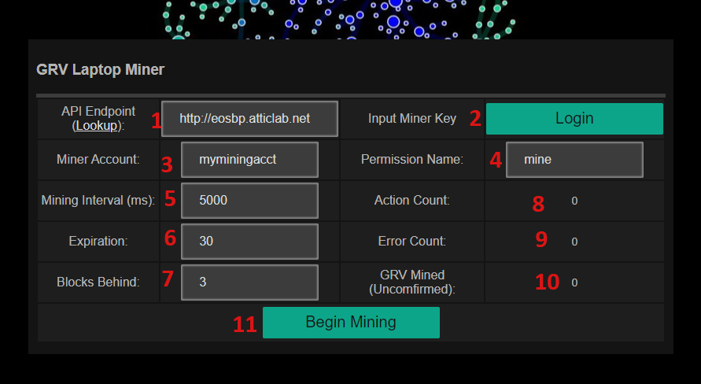

# laptopminer
Mine GRV on your Laptop (Or Desktop Too I Suppose)

GRAVY is a HFT Trading strategy on the EOS main-net. Its business logic is driven by miners who push mine actions to the chain at regular intervals. The more mine actions pushed to the system, the greater the probability of earning arbitrage profits by the trading strategy.

The GRAVY LAPTOP MINER is a stand-alone web page version of [GRAVYMINER](https://github.com/gravytrainproject/gravyminer) which pushes mine actions at regular intervals to the GRAVY mining contract (gravyhftdefi). Miners donate their CPU resources and receive GRV in return for each successful mine action. GRV can be staked in order to earn a portion of EOS trading profits.

This miner DOES NOT USE Scatter / Anchor or any signature provider. It works by entering a private key directly. This private key is only used locally and is not stored, if you close the miner you will have to re-enter your key upon reloading. It is highly recommended that you create a custom permission just for using with the gravyhftdefi:mine action. Use at your own risk.  

1. **API Endpoint**: Choose an API endpoint. If you're not sure, click "Lookup" link to a list of BP supported endpoints to start with. Dont be abusive to endpoints and if you're not sure please consult your BPs as to their rate limits. 

2. **Login/Logout**: Login will prompt you to enter your private key. Logout will remove your key.

3. **Mining Account**: Please enter the account name of the miner you registered with the smart contract (gravyhftdefi)

4. **Permission Name**: Enter the name of the permission you wish to use e.g. "active" or "miner"

5. **Mining Interval**: The number of milliseconds (ms) to wait between pushing each mine action. 

6. **Expiration**: The number of seconds before each transaction times out

7. **Blocks Behind**: The block to reference, dont touch unless you know what you are doing

8. **Action Count**: The number of unconfirmed successful mine actions

9. **Error Count**: The number of errors, if you're getting too many errors you might be out of CPU or have something misconfigured

10. **GRV Mined (Unconfirmed)**: The cumulative amount of GRV you have mined according to the node you are pushing transactions. Note these are unconfirmed amounts and will most likely be different than the final amounts mined on chain. 

11. **Begin / Halt Mining**: Begin mining or halt mining activity. Note that logging out also halts mining automatically. 
